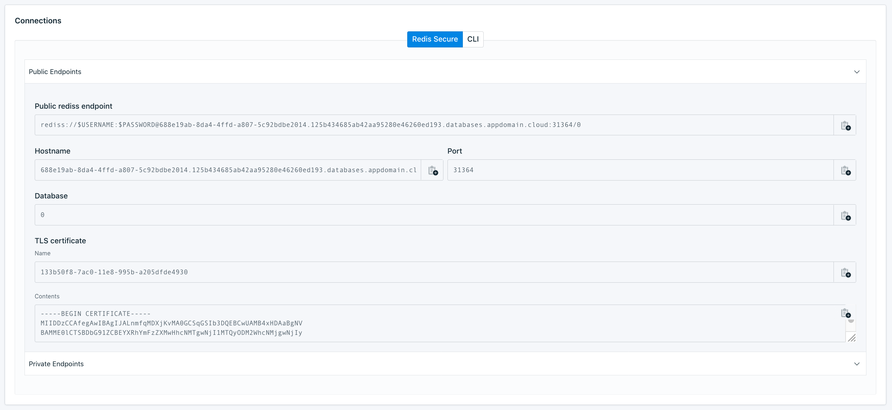

---

copyright:
  years: 2017, 2020
lastupdated: "2020-06-23"

keywords: redis, databases, connection strings

subcollection: databases-for-redis

---

{:new_window: target="_blank"}
{:shortdesc: .shortdesc}
{:screen: .screen}
{:codeblock: .codeblock}
{:pre: .pre}
{:tip: .tip}

# Getting Connection Strings
{: #connection-strings}

The {{site.data.keyword.databases-for-redis_full}} service is provisioned with authentication enabled. You need a username, password, and connection strings to connect and issue commands. In Redis 5.x and prior, there is only the admin user. Redis did not introduce support for multiple users until Redis 6.

Connection Strings for your deployment are displayed on the _Dashboard Overview_, in the _Endpoints_ panel.
All users on your deployment can use the connection strings, including connection strings for either public or private endpoints.



Your Redis deployment is provisioned with an admin user. You must set the admin password before you can use it to connect to the database. For more information, see the [Setting the Admin Password](/docs/databases-for-redis?topic=databases-for-redis-admin-password) page.
{: .tip}

## Getting Connection Strings from the CLI

You can also grab connection strings from the [CLI](/docs/databases-cli-plugin?topic=databases-cli-plugin-cdb-reference#deployment-connections).
```
ibmcloud cdb deployment-connections example-deployment -u <newusername> [--endpoint-type <endpoint type>]
```

Full connection information is returned by the `ibmcloud cdb deployment-connections` command with the `--all` flag. To retrieve all the connection information for a deployment named  "example-deployment", use the following command.
```
ibmcloud cdb deployment-connections example-deployment -u <newusername> --all [--endpoint-type <endpoint type>]
```

If you don't specify a user, the `deployment-connections` commands return information for the admin user by default. If you don't specify an endpoint type, the connection string returns the public endpoint by default. If your deployment has only a private endpoint, you must specify `--endpoint-type private` or the commands return an error. The user and endpoint type is not enforced. You can use any user on your deployment with either endpoint (if both exist on your deployment).

## Getting Connection Strings from the API

To retrieve user's connection strings from the API, use the [`/users/{userid}/connections`](https://{DomainName}/apidocs/cloud-databases-api#discover-connection-information-for-a-deployment-f-e81026) endpoint. You must specify in the path which user and which type of endpoint (public or private) will be used in the returned connection strings. The user and endpoint type is not enforced. You can use any user on your deployment with either endpoint (if both exist on your deployment).
```
curl -X GET -H "Authorization: Bearer $APIKEY" 'https://api.{region}.databases.cloud.ibm.com/v4/ibm/deployments/{id}/users/{userid}/connections/{endpoint_type}'
```

## Connection String Breakdown

### The Redis Section

The "Redis" section contains information that is suited for your applications that make connections to Redis.

Field Name|Index|Description
----------|-----|-----------
`Type`||Type of connection - for Redis, it is "URI"
`Scheme`||Scheme for a URI - for Redis, it is "rediss"
`Path`||Path for a URI - for Redis, it is the database number
`Authentication`|`Username`|The username that you use to connect.
`Authentication`|`Password`|A password for the user - might be shown as `$PASSWORD`
`Authentication`|`Method`|How authentication takes place; "direct" authentication is handled by the driver.
`Hosts`|`0...`|A hostname and port to connect to
`Composed`|`0...`|A URI combining Scheme, Authentication, Host, and Path
`Certificate`|`Name`|The allocated name for the self-signed certificate for database deployment
`Certificate`|Base64|A base64 encoded version of the certificate.
{: caption="Table 1. `redis`/`URI` connection information" caption-side="top"}

* `0...` indicates that there might be one or more of these entries in an array.

For more information on using this information to connect, see the [Connecting an External Application](/docs/databases-for-redis?topic=databases-for-redis-external-app) page.

### The CLI Section

The "CLI" section contains information that is suited for command-line clients that make connections to Redis.

Field Name|Index|Description
----------|-----|-----------
`Bin`||The recommended binary to create a connection; in this case it is `redli`.
`Composed`||A formatted command to establish a connection to your deployment. The command combines the `Bin` executable, `Environment` variable settings and uses `Arguments` as command-line parameters.
`Environment`||A list of keys or values you set as environment variables.
`Arguments`|0...|The information that is passed as arguments to the command shown in the Bin field.
`Certificate`|Base64|A self-signed certificate that is used to confirm that an application is connecting to the appropriate server. It is base64 encoded.
`Certificate`|Name|The allocated name for the self-signed certificate.
`Type`||The type of package that uses this connection information; in this case `cli`. 
{: caption="Table 2. `redis`/`cli` connection information" caption-side="top"}

* `0...` indicates that there might be one or more of these entries in an array.

For more information on using this information, see the [Connecting with a command line client](/docs/databases-for-redis?topic=databases-for-redis-connecting-cli-client) page.
