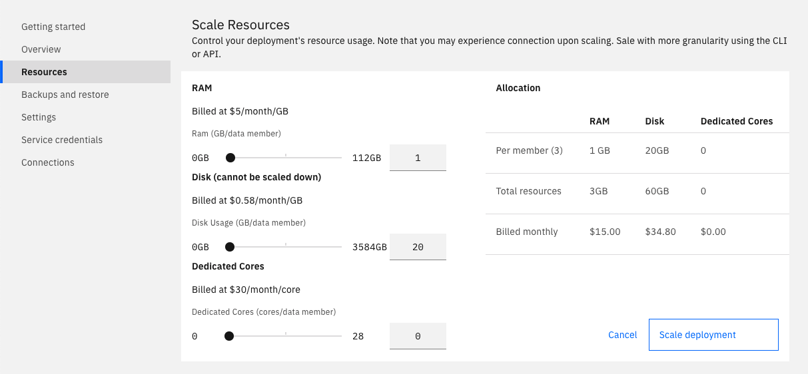

---

Copyright:
  years: 2019, 2021
lastupdated: "2021-03-30"

keywords: redis, databases, scaling, manual scaling, disk I/O, memory, CPU

subcollection: databases-for-redis

---

{:new_window: target="_blank"}
{:shortdesc: .shortdesc}
{:screen: .screen}
{:codeblock: .codeblock}
{:pre: .pre}
{:tip: .tip}

# Scaling Disk, Memory, and CPU
{: #resources-scaling}

You can manually adjust the amount of resources available to your {{site.data.keyword.databases-for-redis_full}} deployment to suit your workload and the size of your data.

## Resources Breakdown

{{site.data.keyword.databases-for-redis}} deployments have two data members in a cluster, and resources are allocated to both members equally. For example, the minimum storage of a Redis deployment is 2048 MB, which equates to an initial size of 1024 MB per member with 512 MB increments available. The minimum RAM for a Redis deployment is 2048 MB, which equates an initial allocation of 1024 MB per member with 124 MB increments available.

Billing is based on the _total_ amount of resources that are allocated to the service.
{: .tip}

When you [provision](/docs/databases-for-redis?topic=cloud-databases-provisioning#provisioning) a deployment, you can select the initial resource allocation of disk and memory. After provision, you can scale your deployment as it needs more resources.

### Disk Usage

By default, {{site.data.keyword.databases-for-redis}} uses disk for data persistence. Your disk allocation per data member has to be enough to store your data. When you add disk to the total allocation, it adds it to both members equally.

Disk allocation also affects the performance of the disk, with larger disks having higher performance. Baseline Input-Output Operations per second (IOPS) performance for disk is 10 IOPS for each GB. Scale disk to increase the IOPS your deployment can handle.

If you have configured Redis as a cache, persistence been disabled on your deployment. If you re-enable Redis persistence, be sure to scale your disk first to prevent losing data.

You cannot scale down storage. You can recover space by backing up and restoring to a new deployment.
{: .tip} 

### Memory

By default, your deployment is configured with a `noeviction` policy  so your memory resources should be scaled to fit your data set. Each data node contains a copy of your data, so the total amount of memory you use is approximately twice the size of your data set. When you add memory to the total allocation, it adds memory to both members equally.

Also, your deployment is configured with `maxmemory` is set to use 80% of the node's memory, so when scaling up memory to accommodate more data, you might also want to [adjust the `maxmemory` setting](/docs/databases-for-redis?topic=databases-for-redis-changing-configuration).

If you [configured Redis as a cache](/docs/databases-for-redis?topic=databases-for-redis-redis-cache), you can scale to the amount of memory that best fits your caching needs.

### Dedicated Cores

You can enable or increase the CPU allocation to the deployment. With dedicated cores, your resource group is given a single-tenant host with a reserve of CPU shares. Your deployment is then guaranteed the minimum number of CPUs you specify. The default of 0 dedicated cores uses compute resources on shared hosts.Going from a 0 to a >0 CPU count provisions and moves your deployment to new hosts, and your databases are restarted as part of that move. Going from >0 to a 0 CPU count, moves your deployment to a shared host and also restarts your databases as part of the move.

## Scaling Considerations

- Scaling your deployment up might cause your databases to restart. If you scale RAM or CPU and your deployment needs to be moved to a host with more capacity, then the databases are restarted as part of the move.

- Scaling down RAM or CPU does not trigger database restarts.

- Disk can not be scaled down.

- A few scaling operations can be more long running than others. Enabling dedicated cores moves your deployment to its own host and can take longer than just adding more cores. Similarly, drastically increasing CPU, RAM, or Disk can take longer than smaller increases to account for provisioning more underlying hardware resources.

- Scaling operations are logged in [{{site.data.keyword.at_full}}](/docs/databases-for-redis?topic=cloud-databases-activity-tracker).

- If you find consistent trends in resource usage or would like to set up scaling when certain resource thresholds are reached, checkout enabling [autoscaling](/docs/databases-for-redis?topic=databases-for-redis-autoscaling) on your deployment.

## Scaling in the UI

A visual representation of your data members and their resource allocation is available on the _Resources_ tab of your deployment's _Manage_ page. 

 

Adjust the slider to increase or decrease the resources that are allocated to your service. The slider controls how much memory or disk is allocated per member. The UI currently uses a coarser-grained resolution than is available via the CLI or API. The UI shows the total allocated memory or disk for the position of the slider. Click **Scale** to trigger the scaling operations and return to the dashboard overview. 

## Scaling in the CLI 

[{{site.data.keyword.cloud_notm}} CLI cloud databases plug-in](/docs/databases-cli-plugin?topic=databases-cli-plugin-cdb-reference) supports viewing and scaling the resources on your deployment. Use the command `cdb deployment-groups` to see current resource information for your service, including which resource groups are adjustable. To scale any of the available resource groups, use `cdb deployment-groups-set` command. 

For example, the command to view the resource groups for a deployment named "example-deployment":  
`ibmcloud cdb deployment-groups example-deployment`

This produces the output:

```
Group   member
Count   2
|
+   Memory
|   Allocation              2048mb
|   Allocation per member   1024mb
|   Minimum                 2048mb
|   Step Size               256mb
|   Adjustable              true
|
+   CPU
|   Allocation              0
|   Allocation per member   0
|   Minimum                 6
|   Step Size               2
|   Adjustable              true
|
+   Disk
|   Allocation              2048mb
|   Allocation per member   1024mb
|   Minimum                 2048mb
|   Step Size               2048mb
|   Adjustable              true
```

The deployment has two members, with 2048 MB of RAM and disk allocated in total. The "per member" allocation is 1024 MB of RAM and disk. The minimum value is the lowest the total allocation can be set. The step size is the smallest amount by which the total allocation can be adjusted.

The `cdb deployment-groups-set` command allows either the total RAM or total disk allocation to be set, in MB. For example, to scale the memory of the "example-deployment" to 2048 MB of RAM for each memory member (for a total memory of 4096 MB), you use the command:  
`ibmcloud cdb deployment-groups-set example-deployment member --memory 4096`

## Scaling in the API

The _Foundation Endpoint_ that is shown on the _Overview_ panel of your service provides the base URL to access this deployment through the API. Use it with the `/groups` endpoint if you need to manage or automate scaling programmatically.

To view the current and scalable resources on the "example-deployment",
```
curl -X GET -H "Authorization: Bearer $APIKEY" 'https://api.{region}.databases.cloud.ibm.com/v4/ibm/deployments/{id}/groups'
```

To scale the memory of the "example-deployment" to 2048 MB of RAM for each memory member (for a total memory of 4096 MB).
```
curl -X PATCH 'https://api.{region}.databases.cloud.ibm.com/v4/ibm/deployments/{id}/groups/member' \
-H "Authorization: Bearer $APIKEY" \
-H "Content-Type: application/json" \
-d '{"memory": {
        "allocation_mb": 4096
      }
    }'
```

More information is in the [API Reference](https://{DomainName}/apidocs/cloud-databases-api#get-currently-available-scaling-groups-from-a-depl).
