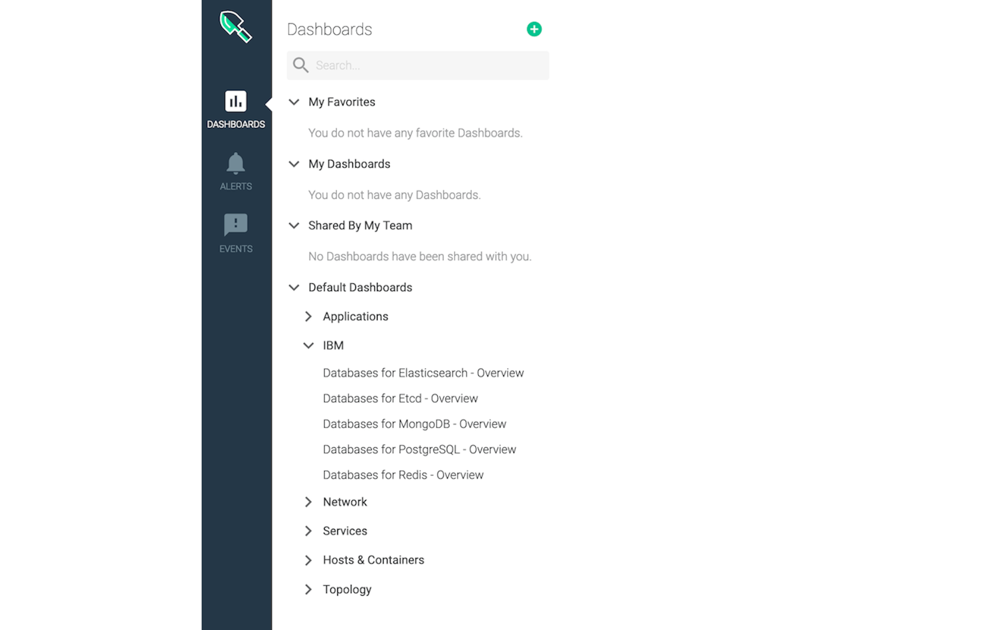

---
copyright:
  years: 2020, 2023
lastupdated: "2023-04-17"

keywords: redis, monitoring, metrics, iops, disk usage, memory usage

subcollection: databases-for-redis

---

{{site.data.keyword.attribute-definition-list}}

# Monitoring Integration
{: #monitoring}

Monitoring for {{site.data.keyword.databases-for-redis_full}} deployments is provided through integration with the {{site.data.keyword.monitoringfull}} service. Your deployments forward selected information so you can monitor deployment health and resource usage. To see your {{site.data.keyword.databases-for-redis}} dashboards in {{site.data.keyword.monitoringfull_notm}}, you have to [Enable Platform Metrics](/docs/monitoring?topic=monitoring-platform_metrics_enabling) in the same region as your deployment. If you have deployments in more than one region, you have to provision {{site.data.keyword.monitoringfull_notm}} and enable platform metrics in each region.

To access {{site.data.keyword.monitoringfull_notm}} from your deployment, use the _Monitoring_ link from the right menu. (If you do not already have a monitoring service in the same region as your deployment it says _Add monitoring_.)

{: caption="Figure 1. The Monitoring link in a deployment" caption-side="bottom"}

To access your deployment's monitoring dashboard from {{site.data.keyword.monitoringfull_notm}}, it's in the sidebar, under _IBM_.

{: caption="Figure 2. Cloud databases dashboard in monitoring" caption-side="bottom"}

## Monitoring Availability
{: #monitoring-availability}

{{site.data.keyword.monitoringfull_notm}} is available for deployments in every region. Deployments in Multi-zone Regions (MZRs) - `eu-gb`, `eu-de`, `us-east`, `us-south`, `jp-tok`, `au-syd` - have their metrics in the corresponding region.

If you have deployments that are in Single-zone Region (SZR) `che01` then your logs are forwarded to a {{site.data.keyword.monitoringfull_notm}} instance in another region. You need to provision monitoring instances in the region where your metrics are forwarded to. Metrics for deployments in `che01` go to `jp-tok`.

## Available Metrics
{: #metrics-by-plan}

| Metric Name |
|-----------|
| [IO utilization in percent 5 minute average](#ibm_databases_for_redis_disk_io_utilization_percent_average_5m) | 
| [IO utilization in percent 15 minute average](#ibm_databases_for_redis_disk_io_utilization_percent_average_15m) | 
| [IO utilization in percent 30 minute average](#ibm_databases_for_redis_disk_io_utilization_percent_average_30m) | 
| [IO utilization in percent 60 minute average](#ibm_databases_for_redis_disk_io_utilization_percent_average_60m) | 
| [IOPS read & write total count for an instance.](#ibm_databases_for_redis_disk_iops_read_write_total) | 
| [Max allowed memory for an instance.](#ibm_databases_for_redis_memory_limit_bytes) | 
| [Total disk space for an instance.](#ibm_databases_for_redis_disk_total_bytes) | 
| [Used CPU for an instance.](#ibm_databases_for_redis_cpu_used_percent) | 
| [Used disk space for an instance (byte)](#ibm_databases_for_redis_disk_used_bytes) | 
| [Used disk space for an instance (percent)](#ibm_databases_for_redis_disk_used_percent) | 
| [Used memory for an instance (byte)](#ibm_databases_for_redis_memory_used_bytes) | 
| [Used memory for an instance (percent)](#ibm_databases_for_redis_memory_used_percent) | 
{: caption="Table 1. Available Metrics Reference Table" caption-side="bottom"}

### IO utilization in percent 5 minute average
{: #ibm_databases_for_redis_disk_io_utilization_percent_average_5m}

How much disk I/O has been used over 5 minutes as a percentage of total disk I/O available.

| Metadata | Description |
|----------|-------------|
| `Metric Name` | `ibm_databases_for_redis_disk_io_utilization_percent_average_5m`|
| `Metric Type` | `gauge` |
| `Value Type`  | `percent` |
| `Segment By` | `Service instance` |
{: caption="Table 2. IO utilization in percent 5 minute average metric metadata" caption-side="top"}

### IO utilization in percent 15 minute average
{: #ibm_databases_for_redis_disk_io_utilization_percent_average_15m}

How much disk I/O has been used over 15 minutes as a percentage of total disk I/O available.

| Metadata | Description |
|----------|-------------|
| `Metric Name` | `ibm_databases_for_redis_disk_io_utilization_percent_average_15m`|
| `Metric Type` | `gauge` |
| `Value Type`  | `percent` |
| `Segment By` | `Service instance` |
{: caption="Table 3. IO utilization in percent 15 minute average metric metadata" caption-side="top"}

### IO utilization in percent 30 minute average
{: #ibm_databases_for_redis_disk_io_utilization_percent_average_30m}

How much disk I/O has been used over 30 minutes as a percentage of total disk I/O available.

| Metadata | Description |
|----------|-------------|
| `Metric Name` | `ibm_databases_for_redis_disk_io_utilization_percent_average_30m`|
| `Metric Type` | `gauge` |
| `Value Type`  | `percent` |
| `Segment By` | `Service instance` |
{: caption="Table 4. IO utilization in percent 30 minute average metric metadata" caption-side="top"}

### IO utilization in percent 60 minute average
{: #ibm_databases_for_redis_disk_io_utilization_percent_average_60m}

How much disk I/O has been used over 60 minutes as a percentage of total disk I/O available.

| Metadata | Description |
|----------|-------------|
| `Metric Name` | `ibm_databases_for_redis_disk_io_utilization_percent_average_60m`|
| `Metric Type` | `gauge` |
| `Value Type`  | `percent` |
| `Segment By` | `Service instance` |
{: caption="Table 5. IO utilization in percent 60 minute average metric metadata" caption-side="top"}

### IOPS read & write total count for an instance
{: #ibm_databases_for_redis_disk_iops_read_write_total}

How many input/output operations per second your deployment is performing.

| Metadata | Description |
|----------|-------------|
| `Metric Name` | `ibm_databases_for_redis_disk_iops_read_write_total`|
| `Metric Type` | `gauge` |
| `Value Type`  | `count` |
| `Segment By` | `Service instance` |
{: caption="Table 6. IOPS read & write total count for an instance metric metadata" caption-side="top"}

### Max allowed memory for an instance
{: #ibm_databases_for_redis_memory_limit_bytes}

The maximum amount of memory available to your deployment.

| Metadata | Description |
|----------|-------------|
| `Metric Name` | `ibm_databases_for_redis_memory_limit_bytes`|
| `Metric Type` | `gauge` |
| `Value Type`  | `byte` |
| `Segment By` | `Service instance` |
{: caption="Table 7. Max allowed memory for an instance metric metadata" caption-side="top"}

### Total disk space for an instance
{: #ibm_databases_for_redis_disk_total_bytes}

Represents the total amount of disk available to your deployment.

| Metadata | Description |
|----------|-------------|
| `Metric Name` | `ibm_databases_for_redis_disk_total_bytes`|
| `Metric Type` | `gauge` |
| `Value Type`  | `byte` |
| `Segment By` | `Service instance` |
{: caption="Table 8. Total disk space for an instance metric metadata" caption-side="top"}

### Used CPU for an instance
{: #ibm_databases_for_redis_cpu_used_percent}

How much CPU is used as a percentage of total CPU available. Only for deployments that have dedicated CPU.

| Metadata | Description |
|----------|-------------|
| `Metric Name` | `ibm_databases_for_redis_cpu_used_percent`|
| `Metric Type` | `gauge` |
| `Value Type`  | `percent` |
| `Segment By` | `Service instance` |
{: caption="Table 9. Used CPU for an instance metric metadata" caption-side="top"}

### Used disk space for an instance
{: #ibm_databases_for_redis_disk_used_bytes}

How much disk your deployment is using in bytes.

| Metadata | Description |
|----------|-------------|
| `Metric Name` | `ibm_databases_for_redis_disk_used_bytes`|
| `Metric Type` | `gauge` |
| `Value Type`  | `byte` |
| `Segment By` | `Service instance` |
{: caption="Table 10. Used disk space for an instance metric metadata" caption-side="top"}

### Used disk space as a percentage of total disk available
{: #ibm_databases_for_redis_disk_used_percent}

How much disk space is used as a percentage of total disk available

| Metadata | Description |
|----------|-------------|
| `Metric Name` | `ibm_databases_for_redis_disk_used_percent`|
| `Metric Type` | `gauge` |
| `Value Type`  | `PERCENT` |
| `Segment By` | `Service instance` |
{: caption="Table 10.5: Used disk space for an instance metric metadata" caption-side="top"}

### Used memory for an instance
{: #ibm_databases_for_redis_memory_used_bytes}

How much memory your deployment is using in bytes.

| Metadata | Description |
|----------|-------------|
| `Metric Name` | `ibm_databases_for_redis_memory_used_bytes`|
| `Metric Type` | `gauge` |
| `Value Type`  | `byte` |
| `Segment By` | `Service instance` |
{: caption="Table 11. Used memory for an instance metric metadata" caption-side="top"}

### Used memory as a percentage of total memory available
{: #ibm_databases_for_redis_memory_used_percent}

How much memory is used as a percentage of total memory available

| Metadata | Description |
|----------|-------------|
| `Metric Name` | `ibm_databases_for_redis_memory_used_percent`|
| `Metric Type` | `gauge` |
| `Value Type`  | `PERCENT` |
| `Segment By` | `Service instance` |
{: caption="Table 11.5: Used memory for an instance metric metadata" caption-side="top"}

## Attributes for Segmentation
{: #attributes}

### Global Attributes
{: #global-attributes}

The following attributes are available for segmenting all of the metrics listed.

| Attribute | Attribute Name | Attribute Description |
|-----------|----------------|-----------------------|
| `Cloud Type` | `ibm_ctype` | The cloud type is a value of public, dedicated, or local. |
| `Location` | `ibm_location` | The location of the monitored resource - this may be a region, data center, or global. |
| `Resource` | `ibm_resource` | The resource being measured by the service - typically a identifying name or GUID. |
| `Resource Type` | `ibm_resource_type` | The type of the resource being measured by the service. |
| `Scope` | `ibm_scope` | The scope is the account, organization, or space GUID associated with this metric. |
{: caption="Table 12. Global Attributes Metadata" caption-side="top"}

### Additional Attributes
{: # additional-attributes}

The following attributes are available for segmenting one or more attributes as described in the reference. See the individual metrics for segmentation options.

| Attribute | Attribute Name | Attribute Description |
|-----------|----------------|-----------------------|
| `Service instance` | `ibm_service_instance` | The service instance segment identifies the instance the metric is associated with. |
| `Service instance name` | `ibm_service_instance_name` | The service instance name provides the user-provided name of the service instance, which isn't necessarily a unique value depending on the name provided by the user. |
| `Resource group` | `ibm_resource_group_name` | The resource group where the service instance was created. |
{: caption="Table 13. Additional Attributes Metadata" caption-side="top"}
