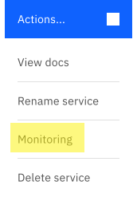

---
copyright:
  years: 2020, 2023
lastupdated: "2023-08-08"

keywords: redis, monitoring, metrics, iops, disk usage, memory usage

subcollection: databases-for-redis

---

{{site.data.keyword.attribute-definition-list}}

# Monitoring Integration
{: #monitoring}

Monitoring for {{site.data.keyword.databases-for-redis_full}} deployments is provided through integration with the {{site.data.keyword.monitoringfull}} service. Your deployments forward selected information so you can monitor deployment health and resource usage. To see your {{site.data.keyword.databases-for-redis}} dashboards in {{site.data.keyword.monitoringfull_notm}}, you have to [Enable Platform Metrics](/docs/monitoring?topic=monitoring-platform_metrics_enabling) in the same region as your deployment. If you have deployments in more than one region, provision {{site.data.keyword.monitoringfull_notm}} and enable platform metrics in each region.

## Monitoring your Instance
{: #monitoring-instance}

Access {{site.data.keyword.monitoringfull_notm}} for your {{site.data.keyword.databases-for-redis}} instance from the {{site.data.keyword.cloud_notm}} dashboard:

- From the dashboard, select your instance from the **Resource list**.
- Within the **Actions** menu, select *Monitoring*.

{: caption="Figure 1. Actions monitoring menu" caption-side="bottom"}

## Monitoring Availability
{: #monitoring-availability}

{{site.data.keyword.monitoringfull_notm}} is available for deployments in every region. Deployments in [multizone regions](#x9774820){: term} (MZRs) - `eu-gb`, `eu-de`, `us-east`, `us-south`, `jp-tok`, `au-syd` - have their metrics in the corresponding region.

If you have deployments that are in a [single-campus multizone region](#x10127487){: term} `che01` then your logs are forwarded to a {{site.data.keyword.monitoringfull_notm}} instance in another region. You need to provision monitoring instances in the region where your metrics are forwarded to. Metrics for deployments in `che01` go to `jp-tok`.

## Available Metrics
{: #metrics-by-plan}

| Metric                                                  | Metric name                                                       | Description                                                                                                | Metric type | Value type | Segment by       |
|---------------------------------------------------------|-------------------------------------------------------------------|------------------------------------------------------------------------------------------------------------|-------------|------------|------------------|
| IO utilization in percent 5 minute average              | `ibm_databases_for_redis_disk_io_utilization_percent_average_5m`  | How much disk I/O has been used over 5 minutes as a percentage of total disk I/O available.                | gauge       | percent    | Service instance |
| IO utilization in percent 15 minute average             | `ibm_databases_for_redis_disk_io_utilization_percent_average_15m` | How much disk I/O has been used over 15 minutes as a percentage of total disk I/O available.               | gauge       | percent    | Service instance |
| IO utilization in percent 30 minute average             | `ibm_databases_for_redis_disk_io_utilization_percent_average_30m` | How much disk I/O has been used over 30 minutes as a percentage of total disk I/O available.               | gauge       | percent    | Service instance |
| IO utilization in percent 60 minute average             | `ibm_databases_for_redis_disk_io_utilization_percent_average_60m` | How much disk I/O has been used over 60 minutes as a percentage of total disk I/O available.               | gauge       | percent    | Service instance |
| IOPS read & write total count for an instance           | `ibm_databases_for_redis_disk_iops_read_write_total`              | How many input/output operations per second your deployment is performing.                                 | gauge       | count      | Service instance |
| Max allowed memory for an instance                      | `ibm_databases_for_redis_memory_limit_bytes`                      | The maximum amount of memory available to your deployment.                                                 | gauge       | byte       | Service instance |
| Total disk space for an instance                        | `ibm_databases_for_redis_disk_total_bytes`                        | Represents the total amount of disk available to your deployment.                                          | gauge       | byte       | Service instance |
| Used CPU for an instance                                | `ibm_databases_for_redis_cpu_used_percent`                        | How much CPU is used as a percentage of total CPU available. Only for deployments that have dedicated CPU. | gauge       | percent    | Service instance |
| Used disk space for an instance                         | `ibm_databases_for_redis_disk_used_bytes`                         | How much disk your deployment is using in bytes.                                                           | gauge       | byte       | Service instance |
| Used disk space as a percentage of total disk available | `ibm_databases_for_redis_disk_used_percent`                       | How much disk space is used as a percentage of total disk available.                                       | gauge       | percent    | Service instance |
| Used memory for an instance                             | `ibm_databases_for_redis_memory_used_bytes`                       | How much memory your deployment is using in bytes.                                                         | gauge       | byte       | Service instance |
| Used memory as a percentage of total memory available   | `ibm_databases_for_redis_memory_used_percent`                     | How much memory is used as a percentage of total memory available                                          | gauge       | percent    | Service instance |
{: caption="Table 1. Available Metrics" caption-side="top"}

## Attributes for Segmentation
{: #attributes}

### Global Attributes
{: #global-attributes}

The following attributes are available for segmenting all of the metrics listed.

| Attribute | Attribute Name | Attribute Description |
|-----------|----------------|-----------------------|
| `Cloud Type` | `ibm_ctype` | The cloud type is a value of public, dedicated, or local. |
| `Location` | `ibm_location` | The location of the monitored resource - this may be a region, data center, or global. |
| `Resource` | `ibm_resource` | The resource being measured by the service - typically a identifying name or GUID. |
| `Resource Type` | `ibm_resource_type` | The type of the resource being measured by the service. |
| `Scope` | `ibm_scope` | The scope is the account, organization, or space GUID associated with this metric. |
{: caption="Table 2. Global Attributes Metadata" caption-side="top"}

### Additional Attributes
{: #additional-attributes}

The following attributes are available for segmenting one or more attributes as described in the reference. See the individual metrics for segmentation options.

| Attribute | Attribute Name | Attribute Description |
|-----------|----------------|-----------------------|
| `Service instance` | `ibm_service_instance` | The service instance segment identifies the instance the metric is associated with. |
| `Service instance name` | `ibm_service_instance_name` | The service instance name provides the user-provided name of the service instance, which isn't necessarily a unique value depending on the name provided by the user. |
| `Resource group` | `ibm_resource_group_name` | The resource group where the service instance was created. |
{: caption="Table 3. Additional Attributes Metadata" caption-side="top"}
